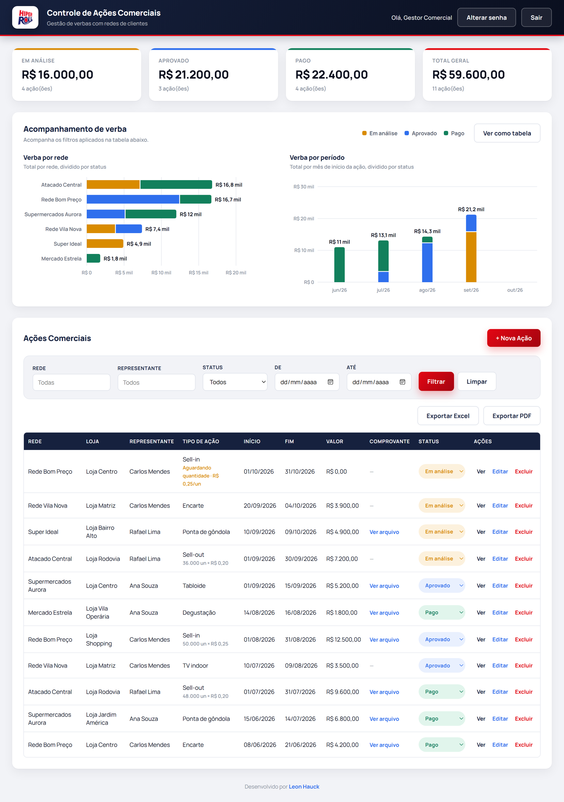
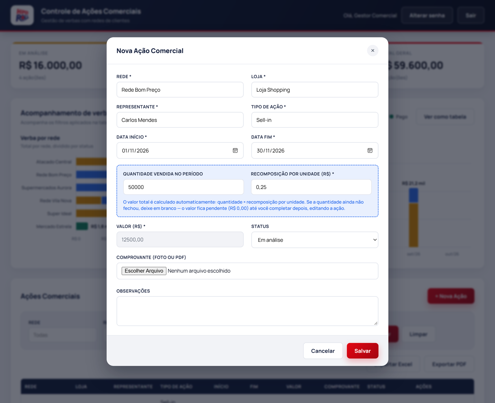
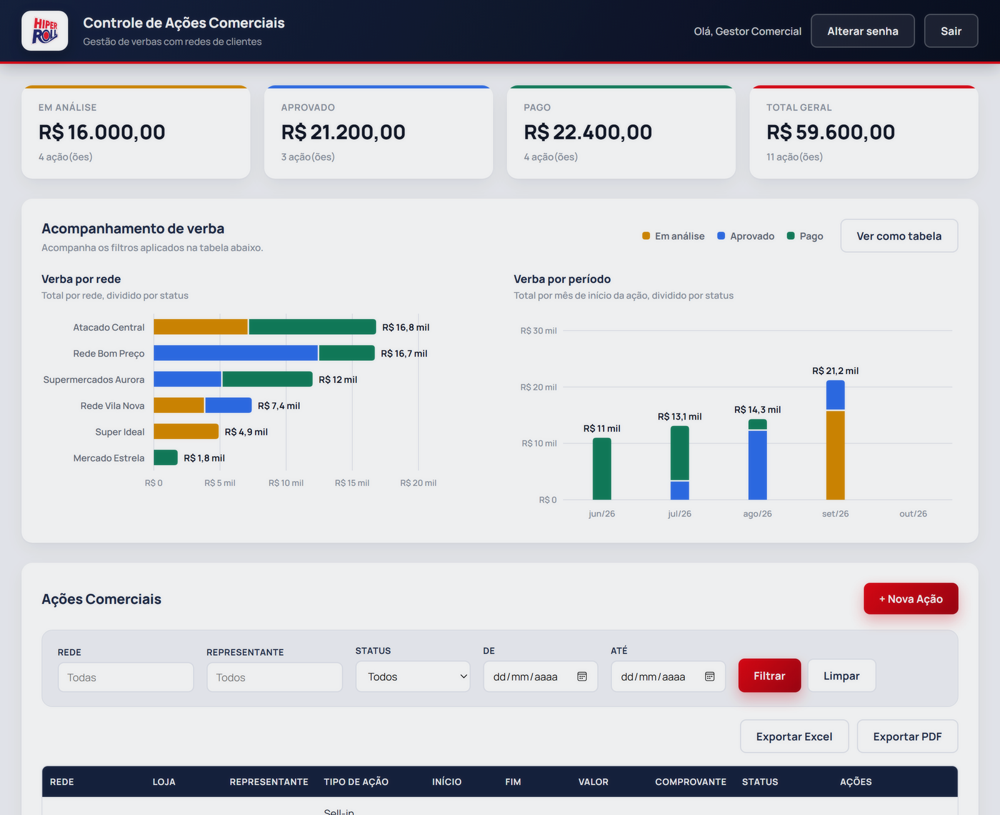
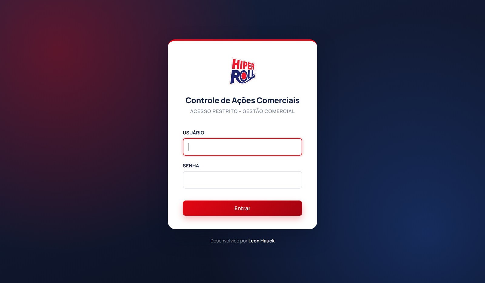
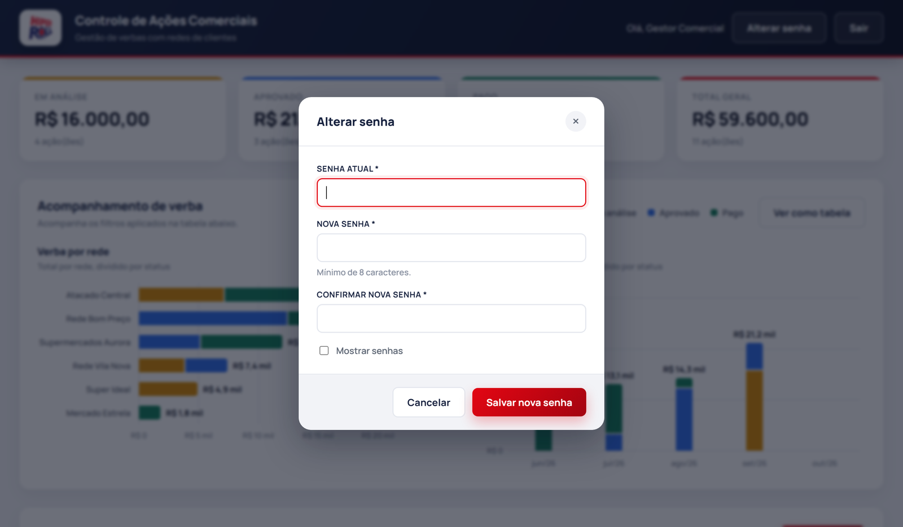
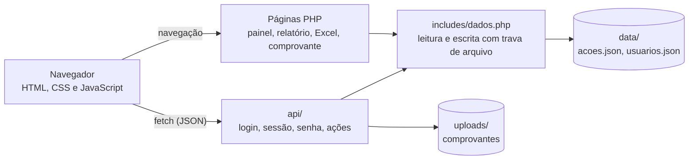

<div align="center">


# Controle de Ações Comerciais

**Registro, aprovação e comprovação das verbas comerciais pagas às redes de clientes da Hiperroll Embalagens.**




</div>

> As telas deste README usam **dados fictícios**, gerados só para demonstração.

## 📑 Índice

- [Sobre o projeto](#-sobre-o-projeto)
- [Telas](#-telas)
- [Funcionalidades](#-funcionalidades)
- [Como funciona o Sell-in e o Sell-out](#-como-funciona-o-sell-in-e-o-sell-out)
- [Arquitetura](#-arquitetura)
- [Estrutura do projeto](#-estrutura-do-projeto)
- [Como publicar](#-como-publicar)
- [Segurança](#-segurança)
- [Roadmap](#-roadmap)
- [Autor](#-autor)

## 🧭 Sobre o projeto

As redes de supermercados realizam ações comerciais em troca de verbas pagas pela
Hiperroll: encartes, pontas de gôndola, degustações, TV indoor, Sell-in, Sell-out e
outras. Cada ação precisa ser registrada, comprovada e aprovada antes do pagamento.

Esse controle era feito em um formulário do Google Docs, sem histórico centralizado,
sem acompanhamento de status e sem visão do total comprometido por rede.

Este sistema substitui o formulário por um painel único, onde o gestor comercial:

- lança cada ação com o comprovante anexado;
- acompanha o status até o pagamento (**Em análise → Aprovado → Pago**);
- enxerga quanto de verba está em cada etapa, por rede e por mês;
- exporta relatórios em Excel e PDF para a prestação de contas.

## 📸 Telas

| Nova ação (Sell-in com cálculo automático) | Detalhes da ação e comprovante |
| :---: | :---: |
|  |  |
| **Login** | **Troca de senha** |
|  |  |

## ✨ Funcionalidades

| | Funcionalidade | O que faz |
| :---: | --- | --- |
| 📝 | **Cadastro de ações** | Rede, loja, representante, tipo de ação, período, valor e observações. Os campos sugerem o que já foi digitado antes, o que evita o mesmo nome escrito de formas diferentes. |
| 🧮 | **Sell-in e Sell-out** | O valor é calculado a partir da quantidade vendida e da recomposição por unidade. [Veja como funciona](#-como-funciona-o-sell-in-e-o-sell-out). |
| 📎 | **Comprovante** | Foto ou PDF anexado a cada ação (JPG, PNG, WEBP ou PDF, até 8 MB). |
| 👁️ | **Visualização e impressão** | Um modal mostra todos os dados da ação e a prévia do comprovante. O comprovante pode ser impresso em uma página com o contexto da ação. |
| 🔄 | **Status** | Em análise, Aprovado ou Pago, alterado direto na tabela. |
| 📈 | **Totais** | Cards com o valor e a quantidade de ações em cada status. |
| 📊 | **Gráficos** | Verba por rede e verba por mês, divididas por status, com detalhe ao passar o mouse e uma visão alternativa em tabela. |
| 🔍 | **Filtros** | Por rede, representante, status e período. Os totais, os gráficos e as exportações acompanham o filtro. |
| 📤 | **Exportação** | Excel (.xls) e PDF, com as mesmas ações que estão na tela. |
| 🔐 | **Acesso** | Login com sessão, troca de senha pelo próprio usuário e bloqueio temporário após 5 tentativas de login erradas. |

## 🧮 Como funciona o Sell-in e o Sell-out

Nessas ações a verba depende do volume vendido no período:

```
valor da ação = quantidade vendida × recomposição por unidade
```

Exemplo: 50.000 unidades vendidas com recomposição de R$ 0,25 geram R$ 12.500,00.

A recomposição é combinada antes da ação, mas a quantidade só é conhecida no
fechamento do período. Por isso:

1. No cadastro, só a **recomposição por unidade** é obrigatória.
2. Enquanto a quantidade não é informada, a ação fica com valor R$ 0,00 e a tabela
   mostra **"Aguardando quantidade"**.
3. Quando o período fecha, o gestor edita a ação, informa a quantidade e o valor é
   calculado.

O cálculo é refeito no servidor a cada gravação, então o valor salvo sempre
corresponde à conta, mesmo que o navegador envie outro número.

## 🧱 Arquitetura



| Camada | Tecnologia | Observação |
| --- | --- | --- |
| Back-end | PHP 8+, sem framework | Roda em qualquer hospedagem compartilhada. |
| Front-end | HTML, CSS e JavaScript puro | Sem etapa de build e sem bibliotecas. Os gráficos são desenhados em SVG. |
| Dados | Arquivos JSON | Cada gravação usa trava de arquivo (`flock`) para não corromper os dados. |

**Por que arquivos JSON em vez de banco de dados?** O sistema tem um único usuário e
um volume pequeno de registros. Sem banco, a publicação se resume a copiar os
arquivos, e o backup é uma cópia de `data/acoes.json`. A leitura e a escrita ficam
concentradas em `includes/dados.php`, o que facilita uma migração para MySQL se o
volume ou o número de usuários crescer.

## 📁 Estrutura do projeto

```
index.html                 Tela de login
dashboard.php              Painel principal
relatorio.php              Relatório para impressão ou PDF
exportar_excel.php         Exportação em Excel
imprimir_comprovante.php   Página de impressão do comprovante de uma ação
logout.php                 Encerra a sessão

api/
  login.php                Valida usuário e senha e inicia a sessão
  sessao.php               Informa se há sessão ativa
  senha.php                Troca a senha do usuário logado
  acoes.php                Lista, salva, altera status e exclui ações

includes/
  config.php               Caminhos e nome do sistema
  dados.php                Leitura e escrita dos arquivos JSON
  consulta_acoes.php       Filtros usados pela tabela, pelo Excel e pelo PDF
  auth.php                 Controle de sessão
  limite_login.php         Limite de tentativas de login por IP

assets/
  css/style.css            Estilo visual
  js/app.js                Tabela, filtros, modais e troca de senha
  js/graficos.js           Gráficos em SVG
  js/login.js              Tela de login
  img/                     Logo e ícones

data/                      Dados do sistema (fora do Git)
uploads/                   Comprovantes enviados (fora do Git)
setup/criar_admin.php      Cria o usuário administrador (uso único)
docs/screenshots/          Telas usadas neste README
```

## 🚀 Como publicar

O único requisito é **PHP 8 ou superior**.

1. Envie os arquivos do projeto para o servidor (por exemplo, pelo Gerenciador de
   Arquivos do cPanel).
2. Confira se as pastas `data/` e `uploads/` têm permissão de escrita. Em geral 755
   é suficiente; use 775 se aparecer erro ao salvar.
3. Crie o usuário administrador abrindo no navegador, com os seus valores:

   ```
   https://seudominio.com.br/setup/criar_admin.php?usuario=SEU_USUARIO&senha=SUA_SENHA&nome=Seu+Nome
   ```

4. **Apague `setup/criar_admin.php` do servidor.** Enquanto ele existir, qualquer
   pessoa com o endereço consegue redefinir a senha.
5. Acesse `https://seudominio.com.br/` e faça login.

Depois do primeiro acesso, a senha pode ser trocada pelo botão **Alterar senha**, no
topo do painel.

**Backup:** copie periodicamente `data/acoes.json` e a pasta `uploads/`.

## 🔒 Segurança

- As senhas são gravadas com `password_hash` (bcrypt), nunca em texto puro.
- A troca de senha exige a senha atual e um mínimo de 8 caracteres.
- O login aceita no máximo 5 tentativas a cada 15 minutos por endereço IP. Acima
  disso, novas tentativas são recusadas até a janela expirar, o que dificulta
  adivinhar a senha por tentativa e erro.
- Não há credenciais no código-fonte: o script de criação do usuário recebe os
  dados na hora do uso.
- As pastas `data/` e `includes/` bloqueiam acesso direto pela internet, e a pasta
  `uploads/` bloqueia a execução de scripts.
- O upload de comprovante valida a extensão e o tamanho do arquivo, e o arquivo é
  renomeado no servidor.
- Os dados (`data/*.json`) e os comprovantes (`uploads/`) ficam fora do Git.

## 📌 Roadmap

- [x] Gráficos de acompanhamento de verba por rede e por período
- [x] Troca de senha pelo usuário
- [x] Limite de tentativas de login
- [ ] Mais de um usuário, com níveis de acesso (por exemplo, o representante vê só as
      próprias ações)
- [ ] Histórico de alterações de cada ação

## 👤 Autor

Desenvolvido por **Leon Hauck** para a Hiperroll Embalagens, com apoio do
[Claude Code](https://claude.com/claude-code).

[](https://www.linkedin.com/in/leon-hauck/)
[](https://github.com/LeonHauck)
